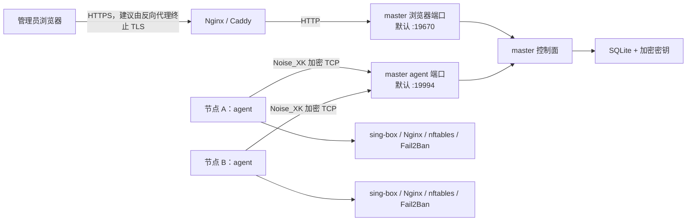

# Polaris

Polaris 是一个面向多台 Linux 代理服务器的集中管理控制面。项目用一个 Go 二进制提供两种运行角色：

- `master`：保存期望配置、提供 Web 控制台、审批节点并下发任务。
- `agent`：运行在受控节点上，上报状态并执行经过校验的系统变更。

**安装步骤见 [INSTALL.md](INSTALL.md)。** 本文档只讲项目本身：它做什么、怎么组织、边界在哪里。

## 设计边界

Polaris 不接收任意 sing-box JSON，也不执行远程 Shell 命令。控制台里的接入服务、出口代理和路由规则先在 master 端编译成受控配置，再由 agent 校验、应用，失败时尝试回滚。agent 只处理固定的任务类型，不接受任意可执行文件路径或 Shell 文本。

## 当前能力

- Vue 3 + Element Plus 管理控制台，构建产物嵌入 Go 二进制。
- 管理员密码、可选的 TOTP 两步验证、首次登录强制改密、会话、CSRF 和 `admin` / `operator` / `viewer` 三类角色。
- 一次性节点注册凭据、节点公钥审批、吊销、在线状态和自动重连。
- sing-box 入站、用户凭据、TLS、Reality、传输层和路由规则管理。
- 全局直连、SOCKS5、HTTP 出站管理。
- 客户端订阅分享链接，以及可下载的 Mihomo YAML 与分流策略。
- sing-box 配置自动应用，并从官方 GitHub Release 获取最新稳定版、校验摘要后签名安装或升级。
- Polaris 自身的自动更新：master 打开控制台时检查 GitHub Release，发现新版本后在控制台提示；管理员确认后 master 校验摘要并原地替换重启，各节点 agent 通过签名任务下发升级并自动重连。
- 同一服务器出现兼容的 TLS TCP 端口重复时，自动生成并发布基于实际 SNI 的端口分配配置。
- nftables 防火墙和 Fail2Ban 配置发布。
- Cloudflare DNS 期望状态、发布确认、远端校验和漂移检测；多域名 Origin CA 源证书，供 VLESS WebSocket 与 gRPC 以 `Full (strict)` 回源。
- 主机累计流量、实时连接、Fail2Ban 状态、任务结果和审计日志。

## 架构



浏览器流量和 agent 流量必须使用不同端口：

| 端口 | 默认值 | 协议 | 用途 |
| --- | --- | --- | --- |
| 浏览器端口 | `:19670` | 明文 HTTP | Web 控制台和 JSON API |
| agent 端口 | `:19994` | Noise 加密的原始 TCP | 节点注册、心跳、任务和实时连接 |

agent 端口不是 HTTP、HTTPS 或 TLS 端口，不能放在会终止 TLS 的 HTTP 反向代理后面。如需转发，只能使用不终止连接的四层 TCP 转发。

## 三种运行模式

| 模式 | 进程内容 | 运行用户 |
| --- | --- | --- |
| `master` | 控制面 + Web 控制台 | `polaris` |
| `agent` | 受控节点代理 | `root` |
| `combined` | 同一进程内同时运行 master 与本机 agent | `root` |

每种模式都支持 YAML 文件启动和纯命令行参数启动。Combined 只有一个长期运行进程，但**不会自动信任本机 agent**：它同样要用一次性令牌注册、由管理员批准，并在后续连接中按固定 Noise 公钥验证身份。

Master 配置只包含端口，不配置监听 IP。Agent 名称自动读取操作系统主机名。配置文件只接受 `.yaml` 或 `.yml`，未知字段会导致启动失败。模板见 `deploy/`。

## 运行要求

- Go、Node.js 和 npm 只在 GitHub Actions 的发布任务中使用。master 和 agent 安装服务器不需要 Go、Node.js、npm 或源码。
- GitHub Release 提供 Linux `amd64` 和 `arm64` 成品包。一个包中的 `polaris` 二进制同时包含 master、agent 和已嵌入的 Web 控制台。
- agent 的系统管理功能面向 Linux 和 systemd，需以 `root` 运行。

受控节点按启用的功能依赖以下本机命令：

| 功能 | 所需命令或服务 |
| --- | --- |
| sing-box 配置发布 | `sing-box`、`systemctl` |
| sing-box 安装或升级 | `systemctl`，并允许访问 GitHub API 与官方 Release 下载地址 |
| 自动 TCP 端口分配 | 首次需要时由 agent 通过 `apt-get`、`dnf`、`yum` 或 `apk` 安装带 stream 功能的 Nginx |
| 防火墙 | `nft` |
| Fail2Ban | `fail2ban-client`、`fail2ban.service` |
| 实时连接 | sing-box Clash API；由受管配置监听 `127.0.0.1:9090` |

sing-box 安装任务只接受 `amd64` 和 `arm64`。master 自动查询官方最新稳定版，并使用官方资源摘要校验下载内容。

## 安装

完整流程、配置字段、验证与故障排查见 **[INSTALL.md](INSTALL.md)**。最短路径：

```bash
curl -fsSLo install.sh https://raw.githubusercontent.com/liyuwei007036/polaris/main/install.sh && sudo bash install.sh master
```

首次登录账户 `polaris_admin` / `123456`，登录后强制改密（至少 12 位）。生产控制台必须由反向代理终止 HTTPS。

## Web 控制台使用流程

推荐按以下顺序配置：

1. 在“节点”中接入并批准服务器。
2. 节点首次上线后会自动安装官方最新稳定版 sing-box；Hysteria2 证书、Reality 密钥与 Short ID 均由系统在生成配置时自动处理，控制台不要求管理员导入或维护证书。
3. 在“出口代理”中按需创建全局 SOCKS5 或 HTTP 出口；不配置时使用内置 `direct`。
4. 在“接入服务”中创建服务并添加用户；每个用户属于该服务所在的服务器，并填写唯一的“客户端节点别名”，保存后自动生成凭据并应用到对应服务器。
5. 在“流量路由”中按需配置直连、拒绝或指定出口规则；变更后自动应用。
6. 在“任务与审计”中确认自动配置任务的执行结果。
7. 在“代理分组”中创建节点分组；分组成员可以是接入用户对应的节点，也可以是其他已保存分组。
8. 在“客户端配置”中引用一个或多个代理分组并手动配置访问规则，生成 Mihomo 更新地址；按需配置防火墙、Fail2Ban 和 Cloudflare。

### 入站协议

当前只支持 `Hysteria2`、`VLESS + Reality`、`VLESS + WebSocket` 和 `VLESS + gRPC`。WebSocket 的请求路径由控制台随机生成且不可手填，新建和复制各自获得独立路径；修改已有服务时保留客户端正在使用的路径，可手动点“重新生成”。VLESS 仅允许 Reality、WebSocket 或 gRPC 三种模式；Hysteria2 使用自身的 QUIC 传输。其他入站协议及传输组合均会被后端拒绝。

WebSocket 和 gRPC 新建时默认启用自动生成的 TLS 源站证书，可通过 Cloudflare `Full` 模式回源。若在“域名解析 → 源证书”中配置了覆盖该接入服务连接域名的 Origin CA 证书，则改用该证书回源，Cloudflare 可使用 `Full (strict)`。Reality 必须使用灰云直连；它的同端口路由键是客户端实际发送的 Reality 目标网站 SNI，而不是连接域名。

同一节点可以让 Reality、WebSocket 和 gRPC 共用公网 TCP/443：Nginx stream 读取 TLS ClientHello 的 SNI 后转发到各自的 loopback 内部端口。Hysteria2 使用 UDP/443，因此可同时占用相同的数值端口。三个 TCP 接入的实际 SNI 必须互不相同。

协议进入类型与校验清单，不代表所有 sing-box 版本和参数组合都经过真实节点互通测试。正式发布前仍应使用目标节点上的实际 sing-box 版本执行配置检查和客户端连通性验证。

### 订阅

客户端订阅把多个 Endpoint 生成的分享链接合并后整体 Base64 编码，目前只生成 VLESS 和 Hysteria2 链接。连接主机优先取每个 Listener 的“连接域名”，历史 Listener 未填写时才回退服务器的“客户端连接地址”；显示名称始终取用户的“客户端节点别名”。

### Mihomo YAML

“客户端配置”只生成供客户端下载的 YAML，不改变 sing-box 服务端配置。“代理分组”是独立菜单和独立资源：分组成员是有序列表，可以混合接入用户对应的节点与其他已保存分组，因此多个分组可以组合成新的分组；分组关系必须是无环图。客户端配置本身不创建或复制分组，只保存对已有分组的引用，生成订阅时递归解析引用闭包。被其他分组或客户端配置引用的分组不能删除。

节点名称取接入服务用户的“客户端节点别名”。创建或修改分组时会检查整个递归闭包中的用户状态、服务器连接地址、协议兼容性、节点别名唯一性以及节点别名与分组名称冲突；修改分组不能使已有客户端规则动作失效。分组改名会同步更新客户端规则中的对应动作。

访问规则只负责分流，不提供任何预定义规则。规则可以使用“表格配置”或“高级纯文本”模式，按 Mihomo 官方规则从上到下匹配；必须由操作者手动配置最后一条 `MATCH`，系统不会补写默认动作或终结规则。客户端配置可以维护远程 HTTP 规则供应商（`rule-providers`），配置行为、格式、规则地址、保存路径、更新间隔和下载代理，并通过 `RULE-SET` 规则引用。创建客户端配置只保存配置，不自动下载；保存后仍可以在列表中手动下载 YAML、复制更新地址或轮换更新地址。

客户端配置使用 Fake-IP 承载代理域名，业务 DNS 返回 `rcode://success`，使代理请求携带原始域名并由最终命中的节点远端解析。规则动作可直接指向节点或代理组：选择组中的 A/B 节点时，代理流量与域名解析随实际节点切换；单独指定 YouTube 等规则走节点 C 时，对应域名也交给 C 远端解析。直连域名及代理服务器地址使用客户端直连 DoH。配置同时启用 TUN、DNS 劫持和严格路由，避免系统普通 DNS 绕过 Mihomo。

用于解析 DoH 服务器域名和代理节点连接域名的 `default-nameserver`、`proxy-server-nameserver` 使用 `https://223.5.5.5/dns-query` 直连引导。Reality 目标网站、WebSocket Host 和 gRPC 服务名称不会替代 Listener 的“连接域名”。配置不会写入明文 UDP/TCP DNS 服务器。

### Cloudflare

Cloudflare 集成支持 `A`、`AAAA`、`CNAME` 和 `TXT` 记录。master 保存期望状态，并将最近一次远端观测结果标记为 `synced`、`drift`、`missing` 等状态。

- 保存 Zone 与 Token 时先调用 Cloudflare 校验，只有校验通过才写入；页面上的“已连接”同样以实时校验为准，Token 失效或网络不通会显示“连接异常”和具体原因。
- “同步”只读取远端状态并检测漂移，不会写入 Cloudflare。
- 单条“发布”先返回差异，确认后才创建或更新远端记录。
- 记录可修改；只存在于 Cloudflare 的记录点“修改”后会先纳入本地期望状态，再经“发布”写回。
- 已发布记录的删除需要二次确认。
- 橙云记录绑定 Listener 后会校验协议、传输层、端口和 TLS 兼容性；不绑定也可以保存，便于接管 Cloudflare 上已有的、并非由本平台提供服务的记录。
- 橙云支持启用 TLS 的 VLESS WebSocket，以及使用 TLS/443 的 VLESS gRPC；Cloudflare 侧还需启用对应的 gRPC 功能。
- Reality 和 UDP Listener 只能使用灰云 DNS。

“源证书”页签保存多条 Cloudflare Origin CA 证书，用于 VLESS WebSocket 和 gRPC 的回源：

- 域名填写纯文本，支持 `*.example.com`（通配一级子域）或完整域名；证书与私钥按 PEM 原文粘贴。
- 保存时校验证书与私钥配对，并要求证书的 SAN 覆盖所填域名。
- 编译配置时按接入服务的“连接域名”匹配：完整域名优先于通配符，未命中的接入服务继续使用自动生成的自签名证书。
- 接入服务的“连接域名”只列出解析到所选服务器的域名（`A`/`AAAA` 记录内容命中该服务器地址，以及指向这些域名的 `CNAME`），并标注各自是否开启橙云加速；其它域名仍可直接手动输入。
- 新增、修改或删除源证书后，受影响节点的 sing-box 配置自动重新编译并下发，无需手动发布；修改域名时新旧两个匹配范围内的节点都会收到新配置。只有 Reality、Hysteria2 或域名不匹配的节点不会被打扰。

## 配置发布与文件边界

| 功能 | 受管位置或对象 | 应用前检查 |
| --- | --- | --- |
| sing-box 配置 | `/etc/sing-box/config.json` | `sing-box check -c` |
| sing-box 二进制 | `/usr/local/bin/sing-box` | Ed25519 清单签名、HTTPS、SHA-256、版本和架构 |
| Nginx Stream | `/etc/nginx/stream-conf.d/polaris.conf` | `nginx -t` |
| 防火墙 | `table inet polaris` | `nft -c -f` |
| Fail2Ban jail | `/etc/fail2ban/jail.d/polaris.local` | `fail2ban-client -t` |
| Fail2Ban filter | `/etc/fail2ban/filter.d/polaris-*.conf` | 文件名和内容边界校验 |

sing-box、Nginx、nftables 和 Fail2Ban 发布都保留或读取上一个状态，并在应用失败时尝试恢复。任务结果记录为 `succeeded`、`failed` 或 `rolled_back`。agent 心跳会上报 sing-box 实际配置哈希，以及 Nginx 最近一次验证成功的期望哈希和实际文件哈希；master 发现任一哈希与当前编译结果不一致时会自动重新下发配置。程序升级后的编译器修复和受管文件漂移因此不需要手工重新发布。

Nginx SNI 分流要求系统的主 Nginx 配置在 `stream {}` 中包含：

```nginx
include /etc/nginx/stream-conf.d/*.conf;
```

防火墙发布只管理 `inet polaris` 表，不会主动修改其他 nftables 表。Fail2Ban 发布只管理 `polaris-` 命名空间。

## 安全模型

- agent 与 master 使用 `Noise_XK` 加密的 TCP 长连接和固定的 Curve25519 身份密钥。
- agent 预先固定 master 公钥；master 在管理员审批后固定 agent 公钥。
- 节点私钥需要更换时，应吊销旧节点并重新注册，不支持原地轮换。
- 管理员密码使用 Argon2id 保存；初始密码必须在首次登录时更换。TOTP 两步验证由每个用户自行扫码启用，启用后登录必须完成动态验证码校验。
- 写请求要求会话 Cookie 和 CSRF Token；Cookie 使用 `HttpOnly`、`SameSite=Strict`，生产默认启用 `Secure`。
- Endpoint 凭据、TLS 私钥、Reality 私钥、源证书私钥和 Cloudflare Token 使用 master key 加密后写入 SQLite。
- API 列表不会回传 Endpoint 密码、TLS 私钥、源证书私钥或完整 Cloudflare Token。
- 任务在 master 中先持久化；离线 agent 重连后会收到未完成任务。
- agent 按任务 ID、类型和内容哈希保存完成结果，重复下发不会重复执行副作用。
- sing-box 安装清单由 master 的 Ed25519 密钥签名，agent 还会校验 HTTPS URL、SHA-256 和 CPU 架构。

自动安装 Nginx 时，agent 会先阻止新安装的服务自动启动；在 Debian/Ubuntu 上移除软件包自带的默认站点，并确认新安装配置没有 HTTP 80 监听后，才启用实际需要的 TCP 入口。如果无法确认不会暴露额外 HTTP 端口，任务会失败并保持 Nginx 停止。已存在的用户自建 Nginx 不会被自动删除或改写。

## 数据目录与备份

master 数据目录：

| 路径 | 内容 |
| --- | --- |
| `polaris.db` | SQLite 控制面数据 |
| `master.key` | 加密数据库中敏感字段的主密钥 |
| `master-noise.key.enc` | 加密保存的 master Noise 私钥 |
| `release-manifest.key.pem` | sing-box 发布清单签名私钥 |

agent 数据目录：

| 路径 | 内容 |
| --- | --- |
| `agent-noise.key` | 节点 Noise 私钥 |
| `release-manifest.pub` | master 的发布签名公钥 |
| `completed-tasks/` | 已执行任务的幂等结果 |

备份或迁移 master 时必须把整个数据目录作为一个整体处理。只有 `polaris.db` 而没有原 `master.key` 时，已加密凭据无法恢复；更换 Noise 私钥也会使现有 agent 固定的 master 公钥失效。

## 可观测性边界

- 节点累计收发字节来自 `/proc/net/dev` 的非回环网卡总和，是主机级累计值，不是单个代理协议的精确流量。
- 实时连接来自 sing-box Clash API，最多上报 1000 条当前连接。
- 浏览器通过经过认证的 Server-Sent Events 接收所有节点的连接快照。
- 不可观测的数据保持为空，不会根据其他指标推算。

## 开发者测试

本节只用于修改项目源码后的开发验证，不属于安装步骤。安装服务器不需要执行这些命令。

单元与进程内集成测试：

```bash
go test ./...
```

覆盖 Noise 握手与消息分帧、注册审批、一次性凭据、角色约束、TLS/Reality 配置编译、任务签名与防篡改、出站编译、Fail2Ban、Cloudflare、实时连接和配置发布流程，但不能代替端到端测试。

端到端测试，Windows：

```powershell
.\scripts_e2e.ps1
```

Linux/macOS：

```bash
bash ./scripts_e2e.sh
```

统一入口依次运行两层测试：

1. `go test -tags=e2e -count=1 -v ./e2e`：构建真实 `polaris` 可执行文件，分别启动 master 和 agent 进程，通过真实 HTTP 与 Noise TCP 连接完成管理员认证、节点注册与审批、心跳、实时连接上报、任务下发与回传、自动应用配置、按用户选择出口、两个 VLESS 自动使用 TCP 443、Hysteria2 使用 UDP 443、自动端口分配、防火墙、Fail2Ban、Mihomo YAML 下载、分页和注销闭环。
2. `npm --prefix webui run test:e2e`：重新构建嵌入式前端，使用真实 Chrome 打开管理平台，验证默认账户、首次强制改密、扫码启用两步验证、启用后的动态验证码登录、全部功能入口、全局服务器筛选、任务分页、接入服务多用户表单、Mihomo 配置入口和手机尺寸布局。

进程级 E2E 使用真实 agent 任务执行器和真实临时文件替换。为了不修改测试宿主机的 `/etc` 与 `/usr/local`，测试启动的 agent 会设置 `POLARIS_E2E_ROOT`，并以可记录调用的确定性命令替代 `sing-box` 和 `systemctl`。生产进程未设置该变量时仍使用标准系统路径。目标 Linux 服务器上的真实 systemd、Nginx、nftables、Fail2Ban 和公网客户端连通性属于部署验收，不能由安全的本地 E2E 替代。

浏览器测试默认使用 Chrome。需要选择其他已安装的 Playwright 浏览器通道时，可以设置 `POLARIS_E2E_BROWSER_CHANNEL`。

仓库中的脚本有明确环境边界：

- `scripts_remote_verify.sh user@host`：把当前构建部署到一台 Linux 主机并检查开发机无法验证的部分——agent 自行安装并配置 Nginx、nftables 和 Fail2Ban。可用 `POLARIS_REMOTE_DIR`、`POLARIS_WEB_PORT`、`POLARIS_AGENT_PORT` 覆盖默认值。
- `scripts_install_test.sh`：用 `DESTDIR` 把 `install.sh` 安装到隔离根目录，校验安装产物，不触碰真实系统。
- `scripts_smoke.sh` 使用硬编码的 Raspberry Pi 路径，只适合对应测试机。
- `scripts_verify.sh` 是兼容入口，现已转交给当前 `scripts_e2e.sh`。

## 发布

`.github/workflows/release.yml` 负责全部编译工作。正式发布推送 `v*` 标签：

```bash
git tag v0.1.0
git push origin v0.1.0
```

GitHub Actions 会验证安装脚本、构建 Web UI、运行 Go 测试、把前端嵌入二进制、分别编译 Linux AMD64 与 ARM64、写入安装脚本与配置模板、生成 `.tar.gz` 与 SHA-256，并创建或更新对应标签的 Release：

```text
polaris_0.1.0_linux_amd64.tar.gz
polaris_0.1.0_linux_amd64.tar.gz.sha256
polaris_0.1.0_linux_arm64.tar.gz
polaris_0.1.0_linux_arm64.tar.gz.sha256
```

在 `Actions` 页面手动运行只生成 Actions Artifacts，不创建正式 Release。

## 项目结构

```text
.
├── .github/workflows/      # AMD64/ARM64 自动构建与 GitHub Release
├── cmd/polaris/            # CLI 入口，master / agent / combined 三种模式
├── deploy/                 # systemd 服务模板与配置模板
├── e2e/                    # 真实 master/agent 进程级黑盒测试
├── internal/agent/         # 节点身份、指标采集和任务执行
├── internal/control/       # 数据库、Web API、配置编译与控制会话
│   └── web/dist/           # 嵌入 Go 二进制的前端构建产物
├── internal/nginxroute/    # Nginx stream 路由条目的校验
├── internal/security/      # 密码、TOTP、Token 和对称加密
├── internal/selfupdate/    # Polaris 自身二进制的校验与原地替换
├── internal/version/       # 构建期注入的版本号
├── internal/wire/          # Noise 连接、分帧和二进制消息
├── webui/                  # Vue 前端源码和 Playwright 浏览器 E2E
├── install.sh              # 一键安装脚本
└── INSTALL.md              # 安装手册
```

## 命令索引

```text
polaris version
polaris master serve       --config MASTER.yaml
polaris master show-pubkey --config MASTER.yaml
polaris master init-admin  ...   # 兼容旧自动化，新部署不需要
polaris master reset-mfa   ...   # 兼容旧自动化，新部署从系统设置管理
polaris agent register     --config AGENT.yaml --token TOKEN
polaris agent serve        --config AGENT.yaml
polaris combined serve     --master-config MASTER.yaml --agent-config AGENT.yaml
```

也支持完全不使用配置文件：

```bash
polaris combined serve \
  --master-data-dir DIR --database-path FILE \
  --agent-port PORT --web-port PORT \
  --agent-data-dir DIR --master HOST:PORT --master-pubkey KEY
```

直接运行参数不足的命令时，程序会输出可用的顶级命令。当前 CLI 不包含证书签发、取回证书或 agent HTTP 轮询命令。
