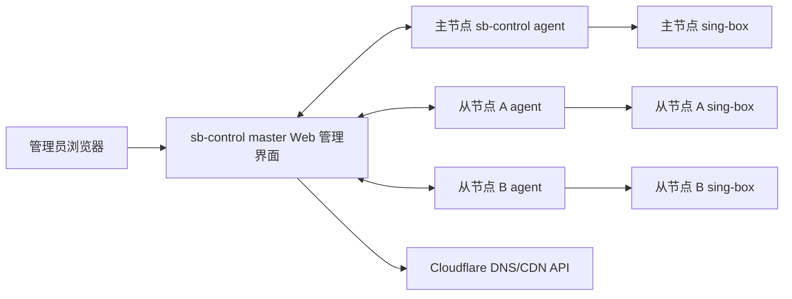
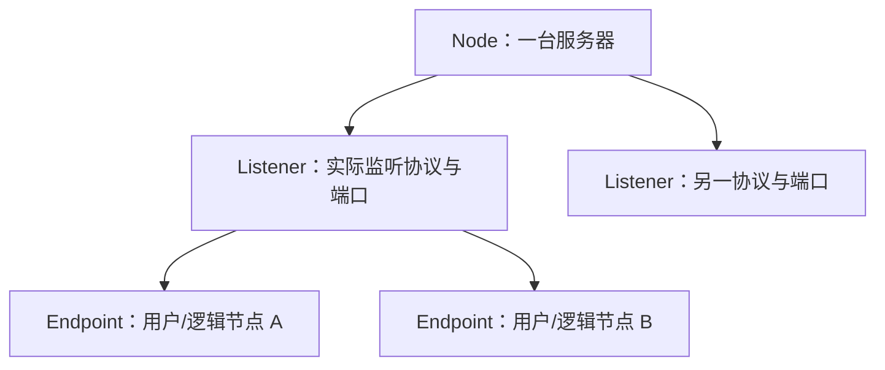

# sb-control 功能与详细设计

> 文档状态：重写版方案设计  
> 日期：2026-07-24  
> 本文只描述已经提出的功能与为实现这些功能所必需的设计，不包含真实 IP、域名、Token、证书或私钥。

## 1. 系统要解决的问题

现有每台服务器都运行 sing-box。系统需要提供一个主节点管理平台：只要新服务器安装 agent 并注册，后续所有 sing-box、协议节点、订阅、规则、Cloudflare DNS/CDN、防火墙、fail2ban、流量和实时连接都从 master 管理。

主节点自身也运行 sing-box，因此它既是控制面，又是一个被管理的服务器节点。



## 2. 功能清单

本节是系统功能的唯一入口。后续数据模型、页面、接口和发布流程必须能追溯到这里的功能编号。

| 编号 | 功能 | 管理者 | 系统必须做到的结果 |
|---|---|---|---|
| F-01 | master Web 管理界面 | 管理员 | 在浏览器中完成全部管理操作；从节点不提供 Web 页面；界面中的写操作必须受身份与权限控制。 |
| F-02 | 节点注册与在线管理 | 管理员 / agent | 新服务器安装 agent 后可使用一次性注册凭据注册到 master；展示在线、离线、系统信息、IP、版本、能力集和服务状态。 |
| F-03 | 主节点自身管理 | master / 本机 agent | 主节点上的 sing-box、Nginx、防火墙和 fail2ban 也通过本机 agent 管理，不存在第二套本机管理逻辑。 |
| F-04 | sing-box 安装与升级 | master / agent | 为指定节点安装或升级指定版本，验证版本、服务状态和监听端口。 |
| F-05 | sing-box 配置发布与回滚 | master / agent | 配置修改先校验、再发布；失败自动恢复上一个成功版本，并记录期望版本与实际应用版本。 |
| F-06 | 协议监听器管理 | 管理员 | 创建、编辑、启停、删除协议 Listener；每个 Listener 独立配置协议、传输、IP、端口、TLS/Reality 等参数。 |
| F-07 | 同协议多逻辑节点 | 管理员 | 同一服务器、同一协议可创建多个独立用户凭据/逻辑节点，而不重复占用端口。 |
| F-08 | 端口与 Nginx 分流管理 | master / agent | 端口完全可配置；只有需要复用同一 TCP IP:端口时，才由 Nginx 分流并检测冲突。 |
| F-09 | 多订阅链接管理 | 管理员 | 可增加、编辑、删除、启停多个订阅链接，并使其参与对应的节点配置与规则管理。 |
| F-10 | 路由规则管理 | 管理员 | 可维护规则、调整优先级、启停规则、预览影响并发布到指定节点。 |
| F-11 | 节点流量监控 | master / agent | 查看每台服务器及其 Listener 的当前上传、下载、总流量和当前连接数；未获底层接口支持的 Endpoint 指标明确标为不可用。 |
| F-12 | 当前连接监控 | master / agent | 在底层版本与协议支持时查看当前入站 IP、目标域名或目标 IP:端口、协议、流量、连接时间和出站结果；不得以推测值补全字段。 |
| F-13 | fail2ban 管理 | 管理员 / agent | 创建、启停、修改 jail/filter，查看封禁状态和封禁记录。 |
| F-14 | 防火墙管理 | 管理员 / agent | 管理 sb-control 专属的端口、CIDR 白名单/黑名单和临时封禁规则；不会清理既有系统规则。 |
| F-15 | Cloudflare DNS 管理 | 管理员 / master | 管理 Zone 内 DNS 记录、目标 IP、TTL、橙云/灰云及节点域名绑定。 |
| F-16 | Cloudflare CDN 状态管理 | 管理员 / master | 按 Listener 类型、传输方式、端口和 Cloudflare 产品能力决定是否允许橙云，展示和修改域名的 CDN 状态。 |
| F-17 | 任务、结果与审计 | master | 每次安装、发布、DNS、Nginx、防火墙、fail2ban 操作都有任务结果、错误和操作者记录。 |
| F-18 | 管理员身份与权限 | 管理员 / master | 仅经认证和授权的操作者可访问管理后台；高风险写操作可追溯到具体身份。 |

## 3. 角色与部署方式

### 3.1 一个 Go 工程、一个二进制、两个运行角色

`sb-control` 是同一个 Go 二进制：

```text
sb-control master   # Web、API、任务、数据持久化、Cloudflare
sb-control agent    # 节点执行、状态采集、本机服务管理
```

不是两个代码仓库，也不是两套协议。两种角色共享 agent 注册协议、任务模型、配置版本模型和审计格式。

### 3.2 主节点部署

主节点必须运行：

```text
sb-control-master.service
sb-control-agent.service
sing-box.service
```

如主节点需要 Web 管理后台与 sing-box 使用同一个公网 TCP IP:端口，再增加 Nginx；若两者不共享端口或不共享 IP，则不要求安装 Nginx。

### 3.3 从节点部署

从节点运行：

```text
sb-control-agent.service
sing-box.service
```

agent 主动建立到 master 的双向 TLS 长连接。master 不依赖 SSH 连接从节点，也不要求从节点向公网开放管理端口。

### 3.4 注册、证书与控制通道

agent 注册不是“连接成功即可信”。固定流程为：

```text
管理员在 master 创建一次性、短时有效的注册凭据
→ agent 本机生成身份私钥与公钥，私钥不提交给 master
→ agent 通过固定的 master 注册地址提交凭据、公钥和基础能力清单
→ master 审核并签发节点证书
→ agent 仅以节点证书建立双向 TLS 长连接
```

- 一次性注册凭据只用于首次登记，不是长期密码；泄露、过期或使用后立即失效。
- master 必须支持节点证书轮换、吊销、节点重装后的重新登记，以及被吊销节点的即时拒绝。
- agent 每次重连都上报自身版本、操作系统、架构、sing-box 版本和构建能力；master 不向能力不兼容的 agent 下发配置。
- 控制通道必须使用独立管理域名或明确的 SNI 路由，不能依赖会被待发布 sing-box 路由、防火墙策略或 Cloudflare DNS 变更同时影响的业务入口。
- 主节点本机 agent 使用同一任务协议，但通过回环地址连接 master；它不能依赖自己即将修改的公网入口来完成回滚。

### 3.5 首个发布范围

首个可用版本只支持一种明确的 Linux 发行版系列、systemd、一个确定的防火墙后端和一组固定的 sing-box 版本/构建能力。其他系统、其他防火墙后端或未验证协议只能在 agent 报告兼容能力并通过专门验收后加入。

这不是限制端口或节点数量，而是避免把 nftables、iptables、UFW 和自定义规则链的差异误判为同一种可自动管理的环境。

## 4. 核心对象与功能映射

### 4.1 三层对象



| 对象 | 对应功能 | 含义 | 必填信息 |
|---|---|---|---|
| `Node` | F-02、F-03、F-04、F-05、F-11、F-14 | 一台实际服务器 | agent 身份、名称、系统、IP、标签、状态、能力集、期望配置版本、实际应用版本。 |
| `Listener` | F-06、F-08、F-11、F-12、F-16 | 一个实际协议监听器 | 协议、TCP/UDP、监听 IP、外部端口、内部端口、传输和安全参数。 |
| `Endpoint` | F-07、F-11、F-12 | 一个独立逻辑节点或用户凭据 | 所属 Listener、名称、协议用户凭据、状态。 |
| `IngressRoute` | F-08、F-16 | 外部 TCP 入口到本机后端的路由 | 外部 IP、端口、SNI/域名、后端 Listener、Nginx 状态。 |
| `Subscription` | F-09 | 一个可管理的订阅链接 | 名称、URL、启停状态、关联对象、最后处理状态。 |
| `Rule` | F-10 | 一条结构化路由规则 | 匹配条件、动作、优先级、启停状态、发布范围。 |
| `CloudflareRecord` | F-15、F-16 | 一个受管 DNS/CDN 记录 | Zone、名称、类型、目标、TTL、橙云状态、绑定 Node/Listener。 |
| `Operator` | F-17、F-18 | 一个管理后台操作者 | 身份来源、角色、MFA 状态、启停状态和最后登录时间。 |

### 4.2 为什么必须区分 Listener 与 Endpoint

一个端口属于 Listener，不属于 Endpoint。多个相同协议节点通常意味着“多个用户凭据”，而不是“多个监听端口”。

示例：

```text
Node：新加坡 A
Listener：VLESS Reality，TCP，端口 P
Endpoint：用户 A，UUID-A，Short ID-A
Endpoint：用户 B，UUID-B，Short ID-B
Endpoint：用户 C，UUID-C，Short ID-C
```

三个 Endpoint 独立管理，但共同使用一个 Reality Listener 和一个 TCP 端口。`P` 由管理员配置，可为 `443`，也可为其他端口；系统不设置固定端口。

同样的共享原则适用于具备多用户能力的协议：一个 Listener 承载多个用户凭据。只有协议参数本身不同，例如 Reality 私钥、握手目标、TLS 参数、WebSocket 路径或 QUIC 参数不同，才创建新的 Listener。

`Endpoint` 是 sb-control 的产品对象，表示“一个可分配、可停用的用户凭据”，不等同于 sing-box 配置顶层的 `endpoints` 字段。每种协议的用户字段由对应的、受 sing-box 版本约束的协议处理器生成，不能以一个无校验的通用 JSON 表单直接下发。

## 5. 协议、端口与 Nginx

### 5.1 端口规则

端口是 Listener 属性，不是全局常量。创建 Listener 时必须填写：

```text
监听 IP
传输层：TCP 或 UDP
公网端口
本机后端端口（需要 Nginx 分流时）
```

master 的冲突校验规则：

| 条件 | 允许结果 |
|---|---|
| 同一 IP + TCP + 同一端口，只有一个 Listener | 允许，sing-box 或 Nginx 直接监听。 |
| 同一 IP + TCP + 同一端口，多个后端 | 仅在创建 Nginx `IngressRoute`、SNI/域名唯一且后端本机端口不同的情况下允许。 |
| 同一 IP + UDP + 同一端口，多个独立 Listener | 拒绝。 |
| 同一 IP + UDP + 同一端口，一个多用户 Listener | 允许。 |

### 5.2 Nginx 的职责

Nginx 不是所有节点的必选组件，只在 F-08 需要复用 TCP 端口或需要 HTTP/WebSocket 反向代理时启用。

当需要以 SNI 复用公网 TCP 端口时：

```text
公网 <共享 TCP 端口>
  → Nginx stream：按 SNI 分流
      → Nginx http 的本机 TLS 端口（管理后台或橙云 WebSocket）
      → sing-box Reality 本机端口
      → sing-box 其他直连 TLS Listener 本机端口
```

- Nginx 只持有共享的公网 TCP 端口；后端服务监听不同的本机端口。
- 每条 `IngressRoute` 的 SNI/域名必须唯一。
- agent 负责配置 Nginx、执行 `nginx -t`、reload 和失败回滚。
- UDP 不使用 Nginx 进行通用协议分流；多个独立 UDP Listener 需要不同端口、不同 IP 或不同服务器。

`stream` 是四层透明转发，只能根据 TLS ClientHello 的 SNI 选后端，不能读取、验证或改写 HTTP 头。因此橙云 WebSocket 若要求真实客户端 IP，必须采用第二层拓扑：

```text
Cloudflare → 公网 stream（按 SNI） → 本机 Nginx http（终止 TLS）
→ 仅信任 Cloudflare 官方 IP 段的真实 IP 头 → 本机 WebSocket Listener
```

- Reality 和其他直连 TCP Listener 继续经 `stream` 透明转发，记录的是直接对端 IP；它们不能被标记为 Cloudflare HTTP 真实 IP。
- Nginx http 的 Cloudflare IP 段必须由 agent 以原子配置更新并在 reload 前校验；来自非 Cloudflare 地址的同名头一律不可信。
- 共享端口的每个协议必须在注册时声明所需入口类型：`stream`、`http` 或不共享端口。系统不得把任意 TCP 流量误配置为 HTTP 反向代理。

### 5.3 443 的定位

`443` 只是管理员可选的端口值，不是默认值、必填值或所有协议的固定值。系统界面不能预填或强制任何协议使用 `443`。

选择 Cloudflare 橙云时，端口还必须满足 Cloudflare 当期支持的 HTTP/HTTPS 代理端口清单；不满足时，F-16 必须拒绝发布，而不是修改成看似成功的橙云记录。原始 TCP/UDP 的 Cloudflare L4 代理属于 Spectrum 范围，不作为本方案 F-15/F-16 的隐式能力。

## 6. sing-box 管理功能

### 6.1 安装与升级（F-04）

管理员选择目标 Node 和 sing-box 版本后，agent：

1. 校验受控发布清单中的来源、架构、SHA-256 和签名/可信发布者；
2. 在替换前记录当前二进制与版本，并检查现有配置在目标版本上的兼容性；
3. 安装或替换指定二进制；
4. 执行 `sing-box version`，采集实际版本和构建能力；
5. 重启服务并读取服务状态；
6. 启动失败时恢复上一个二进制与配置版本；
7. 回报实际版本、构建能力和失败原因。

### 6.2 配置发布（F-05）

master 根据 Node、Listener、Endpoint、Rule、Subscription 和 IngressRoute 生成节点配置版本。agent 发布流程固定为：

```text
下载版本 → 校验哈希 → 写入临时文件 → sing-box check
→ 备份上个成功版本 → 原子替换 → 重启/加载服务
→ 检查服务状态、监听端口、控制 API、日志 → 回报结果
```

任一阶段失败时，agent 恢复上一个成功版本。`sing-box check` 仅验证配置结构；发布成功还必须验证实际服务状态、监听端口和与本次 Listener 对应的真实客户端探针。若所用服务只能通过重启加载配置，任务结果必须明确标记已有连接可能中断，不能宣称无中断发布。

master 保存每个 Node 的“期望版本”和 agent 已确认的“实际应用版本”。同一版本任务只允许一个执行者；断线重投、重复送达或 agent 重启必须依据任务 ID 和版本哈希幂等处理，不能重复重启服务或覆盖较新的版本。

### 6.3 Listener 管理（F-06）

界面必须支持：

- 创建、编辑、复制、启停、删除 Listener；
- 选择协议和 TCP/UDP；
- 配置监听 IP、端口、内部后端端口；
- 配置协议需要的 TLS、Reality、WebSocket、QUIC 或其他传输字段；
- 选择是否关联 Nginx `IngressRoute`；
- 发布前显示端口冲突、SNI 冲突、目标 agent 能力、Cloudflare CDN 端口与协议兼容性结果。

### 6.4 Endpoint 管理（F-07）

界面必须支持：

- 在已有 Listener 下创建多个 Endpoint；
- 为 Endpoint 生成或录入协议用户凭据；
- 编辑名称、启停状态和凭据；
- 删除 Endpoint 时只删除该用户凭据，不删除同 Listener 的其他 Endpoint；
- 显示 Endpoint 所属 Node、Listener、当前连接和流量。

## 7. 多订阅链接与路由规则

### 7.1 订阅链接管理（F-09）

F-09 必须区分两种方向不同的对象，不能用一个 URL 字段混合处理：

| 类型 | 方向 | 用途 |
|---|---|---|
| `UpstreamSubscription` | master 拉取外部内容 | 导入受支持格式的上游节点、规则或规则集。 |
| `ClientSubscription` | 客户端向 master 获取内容 | 根据已启用的 Endpoint 生成或托管客户端订阅。 |

每条 `UpstreamSubscription` 必须支持：

- 新增 URL；
- 编辑名称、URL 和关联对象；
- 启用、停用和删除；
- 显示最后一次处理时间、成功/失败状态和错误摘要；
- 在发布节点配置前展示该链接导致的配置差异；
- 将其结果交给关联的路由规则和节点配置。

`UpstreamSubscription` 的 URL 内容、认证方式和最终配置格式由其关联的协议/规则处理器定义；master 不会让从节点直接执行不受控 URL 下载。拉取器还必须限制允许的协议、重定向次数、响应大小、下载超时和访问目标，拒绝访问本机、内网、链路本地及云元数据地址，以避免 URL 被用作服务端请求伪造入口。

`ClientSubscription` 必须具有独立的可撤销访问凭据、关联 Endpoint 范围和生成版本；停用或删除 Endpoint 后，下一次生成结果不得继续暴露该凭据。订阅内容、访问凭据和上游认证信息均按敏感数据处理，不出现在任务摘要或审计正文中。

### 7.2 路由规则管理（F-10）

每条规则包含：

| 类别 | 内容 |
|---|---|
| 匹配条件 | 域名、域名后缀、IP/CIDR、端口、网络类型、协议、入站、Endpoint。 |
| 动作 | 指定出站、直连、拒绝。 |
| 顺序 | 明确优先级；页面支持调整顺序。 |
| 范围 | 指定适用的 Node、Listener 或全局范围。 |
| 状态 | 启用或停用。 |

规则发布前，master 必须显示目标节点、生成配置差异和可能受影响的 Listener；agent 返回实际应用结果。

规则不是任意 JSON 下发。master 只允许当前 sing-box 版本矩阵中已建模的匹配字段与动作，并生成带稳定 tag 的配置。预览展示的是静态顺序、编译结果和已知冲突；DNS 解析、协议嗅探、TLS/QUIC SNI 等运行时信息无法静态保证命中结果，界面必须明确这一边界。

## 8. 实时流量与当前连接

### 8.1 流量（F-11）

master 的节点页必须显示：

```text
Node 当前上传/下载速率
Node 累计上传/下载量
Listener 当前上传/下载速率
Listener 当前连接数
Endpoint 在协议与统计接口支持时的流量与连接数
```

agent 从本机 sing-box 控制 API、可用的用户统计接口和网络接口计数采集数据。控制 API 只监听本机回环地址，master 不直接暴露或访问从节点控制端口。

每个 Node 上报“指标能力矩阵”，至少列出 Node、Listener、Endpoint 三个层级分别能否提供累计流量、瞬时速率和连接数，以及数据来源和 sing-box 版本。网络接口计数只能作为主机总量或兜底诊断，不能被标记为某个 Listener 或 Endpoint 的精确流量。缺少统计接口、构建能力或协议映射时，页面显示“不可用/不精确”，不得以相邻指标推算。

### 8.2 当前连接（F-12）

当前连接列表字段：

```text
Node、Listener、Endpoint（可获得时）、协议、入站标签、源 IP、源 IP 类型、
目标域名或 IP:端口、上传、下载、开始时间、持续时间、命中的出站
```

来源与目标规则：

- 直连 sing-box：展示 sing-box 看到的源 IP。
- Cloudflare HTTP/WebSocket：仅当流量经 Nginx http 终止 TLS、来源地址命中 Cloudflare 可信 IP 段且真实 IP 头校验成功时，才展示 `CF-Connecting-IP` 并标记为“Cloudflare HTTP 真实 IP”；经 stream 透明转发的连接不适用此规则。
- Reality、Hysteria2、TUIC 和其他直连协议：展示直接对端 IP。
- 目标域名可从 HTTP Host、TLS/QUIC SNI 或协议嗅探得到；无法得到时展示目标 IP:端口。
- 系统不尝试读取 HTTPS 完整 URL、路径、查询参数或请求正文。
- 当前连接字段同样受版本、构建能力和协议限制。agent 先上报可观测字段清单；无法从本机控制 API 或可靠日志获得的字段显示为空，不得从 HTTP 日志、端口或历史记录推断。
- 当前连接与目标信息属于敏感运维数据，仅授予具有 F-18 相应权限的操作者，并设置最短必要的内存保留和审计访问记录。

## 9. fail2ban 与防火墙

### 9.1 fail2ban（F-13）

master 管理 jail 定义，agent 管理本机执行：

- 创建、编辑、启停、删除 jail；
- 配置日志路径、匹配规则、重试次数、时间窗口、封禁时长和动作；
- 校验 fail2ban 配置并 reload；
- 显示 jail 状态、已封禁 IP 和最近封禁事件。

只有从实际 sing-box 或 Nginx 日志提取到可靠模式后，才允许发布对应 jail。

### 9.2 防火墙（F-14）

agent 先识别实际使用的 nftables、iptables、UFW 或自定义规则链。sb-control 仅管理自己创建的专属链，不删除或覆盖既有系统规则。

界面功能：

- 端口放行或拒绝；
- TCP/UDP 限制；
- CIDR/IP 白名单和黑名单；
- 临时封禁和自动到期；
- 查看当前受管规则和实际应用结果。

防火墙变更流程：保存当前专属规则 → 设置自动回滚 → 应用变更 → 强制 agent 建立一次新的控制通道连接并检查目标端口 → 成功后取消自动回滚。已有长连接仍存活不构成连通性成功；新连接失败或验证超时必须自动恢复专属规则。

## 10. Cloudflare DNS/CDN

Cloudflare 在本方案中只实现 F-15 和 F-16。

### 10.1 DNS（F-15）

master 保存 Cloudflare Zone 和受限 API Token；Token 不下发给 agent。界面支持：

- 查询 Zone 和 DNS 记录；
- 创建、修改、删除 A、AAAA、CNAME、TXT；
- 修改目标、TTL 和记录备注；
- 将记录绑定到 Node、Listener 或管理后台域名；
- 发布前显示实际记录与期望记录的差异；
- 发布后重新读取记录并验证解析结果。

master 保存期望状态与最后一次从 Cloudflare 读取到的实际状态。检测到控制台或其他系统造成的漂移时，先展示差异并记录审计，不自动覆盖外部变更；只有经管理员确认的任务才能回写。

### 10.2 CDN（F-16）

每条 CloudflareRecord 具有独立橙云/灰云状态。master 根据 Listener 类型、传输方式、端口和当前 Cloudflare 产品能力执行校验：

| Listener 类型 | CDN 状态 |
|---|---|
| 管理后台 HTTPS | 可在 Cloudflare 支持的 HTTPS 代理端口启用橙云。 |
| 标准 HTTP/HTTPS/WebSocket Listener | 可在 Cloudflare 支持的 HTTP/HTTPS 代理端口启用橙云；发布后需要真实连接验证。 |
| Reality | 仅灰云。 |
| Hysteria2、TUIC、一般 UDP | 仅灰云。 |
| Shadowsocks 原始 TCP/UDP | 仅灰云。 |

本方案不把 Spectrum 视为普通橙云开关。若未来纳入 Spectrum，必须新增独立对象、套餐能力检查、L4 转发与 Proxy Protocol 验证，不能复用 CloudflareRecord 的标准 HTTP/CDN 流程。

CDN 状态与 DNS 记录修改均由 master 执行，并进入 F-17 审计。任何可能改变 master 管理域名可达性的 DNS/CDN 任务，必须先验证备用控制通道或自动回滚条件。

## 11. 任务、审计与失败处理

### 11.1 任务（F-17）

每个写操作生成一个任务：

```text
创建/编辑 Listener
发布 sing-box 配置
发布 Nginx 配置
安装或升级 sing-box
应用防火墙规则
发布 fail2ban jail
修改 Cloudflare DNS/CDN
```

任务状态：`待执行 → 等待 agent → 执行中 → 成功 / 失败 / 已回滚 / 超时`。状态迁移只能由任务所有者或对应 agent 的已认证回报驱动。

每次任务至少记录：任务 ID、幂等键、操作者、目标 Node、目标对象、提交内容摘要、期望版本哈希、实际应用版本、开始/结束时间、agent 输出摘要、失败原因和回滚结果。敏感配置正文、订阅凭据、私钥和 Cloudflare Token 不能进入任务输出或审计正文。

### 11.2 变更原则

- 不直接覆盖正在运行的配置；
- 每次发布保留上一个成功版本；
- 配置校验成功不等于服务可用；
- 每次实际变更后检查服务状态、监听端口和真实连接；
- 任何 Cloudflare、防火墙和 fail2ban 变更都必须显示差异后才允许提交。
- 对同一 Node 的相互覆盖任务按配置版本串行执行；过期任务不得覆盖已经成功应用的较新版本。

## 12. Web 管理界面

| 页面 | 覆盖功能 |
|---|---|
| 总览 | F-02、F-11、F-17：节点状态、当前流量、当前任务、失败告警。 |
| 节点 | F-02、F-03、F-04、F-05：系统信息、服务状态、版本、配置发布和回滚。 |
| Listener | F-06、F-08、F-16：协议、端口、SNI、Nginx 路由、Cloudflare 兼容性。 |
| Endpoint | F-07、F-11、F-12：用户凭据、状态、当前连接和流量。 |
| 订阅 | F-09：订阅链接、状态、关联对象和配置差异。 |
| 路由规则 | F-10：规则条件、动作、顺序、范围和发布预览。 |
| 实时连接 | F-11、F-12：源 IP、目标域名/IP、流量、协议和出站。 |
| 防火墙与 fail2ban | F-13、F-14：规则、jail、封禁和任务结果。 |
| Cloudflare | F-15、F-16：Zone、DNS、橙云/灰云、Node/Listener 绑定。 |
| 审计与任务 | F-17：操作记录、执行结果、错误与回滚。 |
| 管理员与安全 | F-18：操作者、角色、MFA 状态、会话和节点证书状态。 |

## 13. 数据与接口边界

### 13.1 持久化对象

master 的持久化存储至少包含：

```text
Node、AgentIdentity、Listener、Endpoint、IngressRoute、Subscription、Rule、
配置版本、发布任务、CloudflareRecord、防火墙策略、fail2ban jail、审计记录、
Operator、角色、会话、证书状态、能力矩阵、期望版本和实际应用版本
```

敏感数据包括协议用户凭据、Reality 私钥、TLS 私钥、订阅认证信息和 Cloudflare Token。master 将其作为加密事实源保存；API、日志和 Web 页面只显示脱敏值。agent 只接收运行当前版本所必需的秘密，并在本机以最小文件权限保存；秘密不得写入日志、任务摘要或诊断包。

master 的持久化存储必须支持事务、加密备份、恢复演练和保留策略。首个版本是单 master，不宣称高可用；master 数据库不可恢复时，节点仍运行最后成功配置，但不能进行新的控制面写操作。

### 13.2 master 与 agent 的固定接口

| 类别 | master 下发 | agent 回报 |
|---|---|---|
| 注册 | 一次性注册确认、节点证书、证书轮换或吊销通知 | 节点公钥、系统与服务清单、agent 版本和能力集。 |
| 配置 | sing-box/Nginx/fail2ban/防火墙的指定版本、任务 ID、幂等键和哈希 | 校验、应用、服务、端口、实际版本、回滚结果。 |
| 监控 | 采集频率和启停指令 | 流量、当前连接、指标能力矩阵、日志摘要、服务状态。 |
| 软件 | 指定 sing-box 工件与哈希 | 安装版本、构建能力、失败原因。 |

agent 不接收任意 Shell 文本，不接收 Cloudflare Token，不暴露其本机 sing-box 控制 API 到公网。

### 13.3 管理后台安全边界

- F-18 至少实现管理员身份认证、角色授权、MFA、会话超时、CSRF 防护和写操作审计；首次部署不得存在固定默认管理员密码。
- 所有高风险动作（删除 Listener、吊销节点证书、安装二进制、修改防火墙、修改 Cloudflare DNS/CDN）必须在提交页显示目标与差异，并记录操作者身份。
- master 对 agent、管理员和 Cloudflare API 使用不同凭据与最小权限；任一凭据都不能替代另一类身份。

## 14. 实施顺序与验收

| 阶段 | 交付功能 | 验收方式 |
|---|---|---|
| P-0 | F-18、注册与安全基础 | 管理员完成 MFA 登录；一次性注册凭据只能使用一次；节点证书可轮换和吊销；无默认密码。 |
| P-1 | F-01、F-02、F-03 | 主节点和从节点完成注册；主节点自身也能通过本机 agent 上报状态；agent 断线重连后身份与能力集不变。 |
| P-2 | F-04、F-05、F-17 | 在固定系统、固定 sing-box 版本和一种已支持协议上，下发有效配置成功；下发无效配置自动回滚；以独立真实客户端验证新旧版本可连接；重复任务不重复执行。 |
| P-3 | F-06、F-07 | 同一 Listener 下多个 Endpoint 可独立连接、停用和统计；未支持的 Endpoint 指标明确显示不可用；端口冲突被阻止。 |
| P-4 | F-08、F-15、F-16 | stream 与 Nginx http 两种入口均通过专门拓扑验证；橙云 WebSocket 真实 IP 仅在可信反代链中出现；不兼容端口、协议或产品能力的橙云修改被拒绝。 |
| P-5 | F-09、F-10 | 上游订阅与客户端订阅分别维护、预览并作用于目标节点配置；非法拉取目标被拒绝；规则只生成受当前版本支持的字段。 |
| P-6 | F-11、F-12 | 页面展示 agent 实际上报的指标能力矩阵；以已支持协议验证流量、连接、源 IP 和目标字段；无法取得的字段为空。 |
| P-7 | F-13、F-14 | jail 与防火墙专属规则可发布、验证、回滚；强制建立新的 agent 控制连接后仍可用，失败时自动恢复。 |

## 15. 结论

sb-control 的功能核心不是“固定某个端口”，而是以 master 集中管理 Node、Listener、Endpoint、Subscription、Rule、CloudflareRecord 和安全策略。端口属于 Listener，多个同协议节点优先通过同一个 Listener 的多用户能力实现；只有必须共享同一 TCP IP:端口时才引入 Nginx。

系统的可信边界由管理员身份、master、agent 节点证书和受控配置版本共同构成。agent 只执行结构化、可验证、可回滚的任务；master 不向 agent 下发任意 Shell 或 Cloudflare Token。Cloudflare 仅用于本方案定义的 DNS/CDN 场景，标准橙云与 Spectrum 的 L4 能力严格分开。实时监控以 agent 实际报告的 sing-box 版本、构建能力和协议能力为准，不以推测填补不可观测字段。
